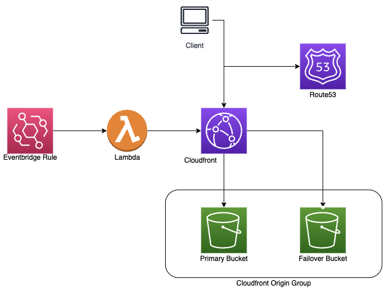

# S3 Static Website Terraform Template
This terraform template will create all infrastructure necessary to run an AWS S3 static website. Below are the pre-requisites, the configurable variables, and the resources it will create.

### Pre-requistes
1. This is a public module published to the Terraform registry: https://registry.terraform.io/modules/cullancarey/static-s3-website-template/aws/latest
	- **Note:** If you are using the module, please ensure you copy the "custom_header_lambda" directory and the contained python file into the directory where you'll be deploying the terraform. The module depends on this directory being present and is not included when using the module itself. 
2. An AWS account with admin access or specific access to relevant services listed in Resources below. 
3. Terraform installed. See https://learn.hashicorp.com/tutorials/terraform/install-cli for details.
4. A public hosted zone that will be used for the website. This zone **must** be named the same name as the website. For example, my website is cullancarey.com, so my hosted zone is named cullancarey.com. 
	- **NOTE:** If you register your domain within Route53, there will be an option to create a hosted zone from the newly registerd domain. I recommend you use this option, especially if you do not understand DNS functionality.

### Variables
1. root_domain_name
	- Type: string
	- Description: The domain name of your website.
2. custom_header
	- Type: string
	- Description: The header value for the secret string passed from Cloudfront to S3.
	- Default: Referer
3. cron_schedule
	- Type: string
	- Description: A cron job specifying how often the lambda is triggered to update the secret string.
	- Default: cron(0 6 1 * ? \*)
		- Default schedule is 06:00 on the first day of each month.
4. website-bucket-region
	- Type: string
	- Description: The primary region where your website will be hosted.
5. backup-website-bucket-region
	- Type: string
	- Description: The region where your backup bucket will be located.
6. cloudfront_price_class
	- Type: string
	- Description: The price class for the Cloudfront distribution. Valid entries are PriceClass_All, PriceClass_200, or PriceClass_100.
	- Default: PriceClass_100

### Resources

#### Primary S3 Bucket
A S3 bucket to act as the primary bucket for hosting the website. It is configured for public access but will only allow reads from requests that include a secret string configured in the Cloudfront distribution.

#### Failover S3 bucket
A S3 bucket in a different region for failover purposes. It is configured for public access but will only allow reads from requests that include a secret string configured in the Cloudfront distribution.

#### Cloudfront Distribution
A Cloudfront distribution to cache static files at the edge and help with performance of your website. It creates an origin group which includes the primary and failover S3 website buckets. It is configured with a secret string that is passed along to S3 for reading the files. It will be configured to your main domain name (ex: cullancarey.com) and a sub-domain name (ex: www.cullancarey.com).

#### Lambda Function
A Lambda function that rotates the secret key passed from Cloudfront to S3. 

#### AWS ACM Certificate
A ACM certificate that is used by Cloudfront. This allows for the website to be securly accessed over SSL/TLS.

#### Route53 Records
Route53 records including the Cloudfront distribution and the ACM validation records.

